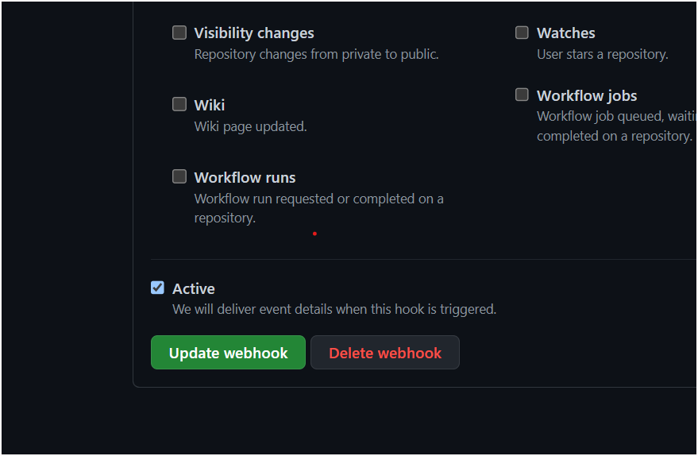

Pull Request
-------------

* Whenever you want to make a change in other repository which does not belong to you then we will make a pull request to the owner of the repository. If the owner satisfies with our changes the he will merge the request to his repository.
* If we want to test the pull request we verify it by building the changes done by others and if want make this automatically in Jenkins we configure it with a plugin called ' Github Pull request Builder '.

* After installing the plugin and restarting the Jenkins we configure the plugin with GitHub Token 

* Now in Github we have to change settings of our repository to trigger a Jenkins Job when a pull request is made to the repository.

* Now we take a new free style project and configure it as follows.

* Once you have Save the job with above configuration the build gets automatically trigerred when ever a new pull 

### References:

[Click here ](https://devopscube.com/jenkins-build-trigger-github-pull-request/) for devopscude step by step guide

[Click here ](https://plugins.jenkins.io/ghprb/) for Plugin description
